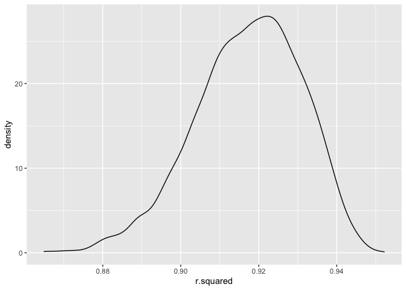
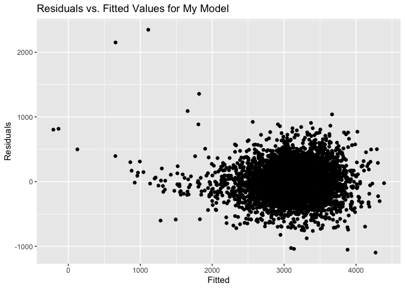
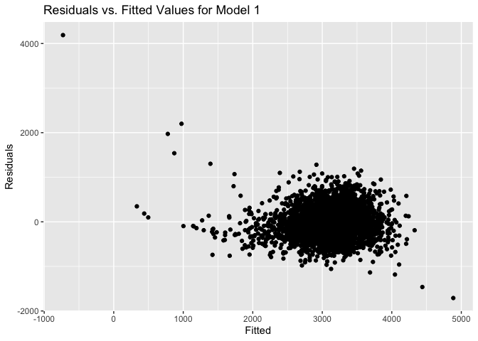

P8105 HW 6
================
Yuki Low (yl5503)
11/27/2023

``` r
library(dplyr)
```

    ## 
    ## Attaching package: 'dplyr'

    ## The following objects are masked from 'package:stats':
    ## 
    ##     filter, lag

    ## The following objects are masked from 'package:base':
    ## 
    ##     intersect, setdiff, setequal, union

``` r
library(broom)
library(ggplot2)
library(modelr)
```

    ## 
    ## Attaching package: 'modelr'

    ## The following object is masked from 'package:broom':
    ## 
    ##     bootstrap

``` r
library(tidyr)
library(purrr)
library(broom)
```

Importing the weather dataframe

``` r
weather_df = 
  rnoaa::meteo_pull_monitors(
    c("USW00094728"),
    var = c("PRCP", "TMIN", "TMAX"), 
    date_min = "2022-01-01",
    date_max = "2022-12-31") |>
  mutate(
    name = recode(id, USW00094728 = "CentralPark_NY"),
    tmin = tmin / 10,
    tmax = tmax / 10) |>
  select(name, id, everything())
```

    ## using cached file: /Users/yukilow/Library/Caches/org.R-project.R/R/rnoaa/noaa_ghcnd/USW00094728.dly

    ## date created (size, mb): 2023-09-28 09:58:44 (8.524)

    ## file min/max dates: 1869-01-01 / 2023-09-30

We set the seed to maintain consistency and start bootstrapping 5000
samples. We want the estimate for the intercept and both of our
variables `tmin` and `prcp`. We also want the r-squared value that is
calculated from each model obtained.

``` r
set.seed(123)

bootstrap =
  weather_df %>%
  bootstrap(n = 5000) %>%
  mutate(
    models = map(strap, \(df) lm(tmax ~ tmin + prcp, data = df)),
    results = map(models, tidy),
    rsquared = map(models,glance)) %>%
  select(results, rsquared) %>% unnest(rsquared) %>%
  select(results, r.squared) %>% unnest(results) %>%
  select(term, estimate, r.squared) 

bootstrap
```

    ## # A tibble: 15,000 × 3
    ##    term        estimate r.squared
    ##    <chr>          <dbl>     <dbl>
    ##  1 (Intercept)  8.07        0.916
    ##  2 tmin         1.02        0.916
    ##  3 prcp        -0.00306     0.916
    ##  4 (Intercept)  8.05        0.914
    ##  5 tmin         1.01        0.914
    ##  6 prcp        -0.00188     0.914
    ##  7 (Intercept)  7.41        0.931
    ##  8 tmin         1.04        0.931
    ##  9 prcp         0.00376     0.931
    ## 10 (Intercept)  8.44        0.905
    ## # ℹ 14,990 more rows

Plotting the distribution of $R^2$

``` r
bootstrap %>%
  filter(term == "(Intercept)") %>%
  ggplot(aes(x = r.squared)) +
  geom_density()
```

<!-- -->
From looking at the distribution of R-squared values, it can be seen
that there is a slight left skew.

Calculating the confidence interval for R-squared value.

``` r
r_squared_CI <-
  bootstrap %>%
  filter(term == "(Intercept)") %>%
  select(r.squared) %>%
  summarize(ci_lower = quantile(r.squared, 0.025), 
            ci_upper = quantile(r.squared, 0.975))

r_squared_CI
```

    ## # A tibble: 1 × 2
    ##   ci_lower ci_upper
    ##      <dbl>    <dbl>
    ## 1    0.888    0.940

We are 95% confident that our true r-squared value falls in between the
interval (0.8882079, 0.9402552)

Distribution of $log(\beta_1 * \beta_2)$

``` r
bootstrap %>%
  pivot_wider(names_from = term, values_from = estimate) %>% 
  rename(beta_1 = tmin, 
         beta_2 = prcp) %>% 
  mutate(log_beta1_beta2 = log(beta_1 * beta_2)) %>% 
  ggplot(aes(x = log_beta1_beta2)) + 
  geom_density()
```

    ## Warning: There was 1 warning in `mutate()`.
    ## ℹ In argument: `log_beta1_beta2 = log(beta_1 * beta_2)`.
    ## Caused by warning in `log()`:
    ## ! NaNs produced

    ## Warning: Removed 3363 rows containing non-finite values (`stat_density()`).

<!-- --> The
distribution of our $log(\beta_1 * \beta_2)$ terms is skewed to the
left.

``` r
log_beta1_beta2_CI <- bootstrap %>%
  pivot_wider(names_from = term, values_from = estimate) %>% 
  rename(beta_1 = tmin, 
         beta_2 = prcp) %>% 
  mutate(log_b1_b2 = log(beta_1 * beta_2)) %>%
  summarize(ci_lower = quantile(log_b1_b2, 0.025, na.rm = T), 
            ci_upper = quantile(log_b1_b2, 0.975, na.rm = T), 
            NA_count = sum(is.na(log_b1_b2)))
```

    ## Warning: There was 1 warning in `mutate()`.
    ## ℹ In argument: `log_b1_b2 = log(beta_1 * beta_2)`.
    ## Caused by warning in `log()`:
    ## ! NaNs produced

``` r
log_beta1_beta2_CI
```

    ## # A tibble: 1 × 3
    ##   ci_lower ci_upper NA_count
    ##      <dbl>    <dbl>    <int>
    ## 1    -9.06    -4.62     3363

We are 95% confident that our true $log(\beta_1 * \beta_2)$ value falls
in between the interval (-9.0632139, -4.6192674)

``` r
library(readr)
library(knitr)
library(MASS)
```

    ## 
    ## Attaching package: 'MASS'

    ## The following object is masked from 'package:dplyr':
    ## 
    ##     select

2.  Importing the dataset needed

``` r
birthweight_df = 
  read_csv("./birthweight.csv") %>%
  janitor::clean_names() %>% 
  mutate(
  babysex = factor(babysex), 
  babysex = recode_factor(babysex, "male" = "1", "female" = "2"), 
  frace = factor(frace), 
  frace = recode_factor(frace, "white" = "1", "black" = "2", "asian" = "3", 
                       "puerto rican" = "4", "other" = "8", "unknown" = "9"), 
  malform = factor(malform), 
  mrace = factor(mrace), 
  mrace = recode_factor(frace, "white" = "1", "black" = "2", "asian" = "3", 
                       "puerto rican" = "4", "other" = "8")
)
```

    ## Rows: 4342 Columns: 20
    ## ── Column specification ────────────────────────────────────────────────────────
    ## Delimiter: ","
    ## dbl (20): babysex, bhead, blength, bwt, delwt, fincome, frace, gaweeks, malf...
    ## 
    ## ℹ Use `spec()` to retrieve the full column specification for this data.
    ## ℹ Specify the column types or set `show_col_types = FALSE` to quiet this message.

``` r
birthweight_df
```

    ## # A tibble: 4,342 × 20
    ##    babysex bhead blength   bwt delwt fincome frace gaweeks malform menarche
    ##    <fct>   <dbl>   <dbl> <dbl> <dbl>   <dbl> <fct>   <dbl> <fct>      <dbl>
    ##  1 2          34      51  3629   177      35 1        39.9 0             13
    ##  2 1          34      48  3062   156      65 2        25.9 0             14
    ##  3 2          36      50  3345   148      85 1        39.9 0             12
    ##  4 1          34      52  3062   157      55 1        40   0             14
    ##  5 2          34      52  3374   156       5 1        41.6 0             13
    ##  6 1          33      52  3374   129      55 1        40.7 0             12
    ##  7 2          33      46  2523   126      96 2        40.3 0             14
    ##  8 2          33      49  2778   140       5 1        37.4 0             12
    ##  9 1          36      52  3515   146      85 1        40.3 0             11
    ## 10 1          33      50  3459   169      75 2        40.7 0             12
    ## # ℹ 4,332 more rows
    ## # ℹ 10 more variables: mheight <dbl>, momage <dbl>, mrace <fct>, parity <dbl>,
    ## #   pnumlbw <dbl>, pnumsga <dbl>, ppbmi <dbl>, ppwt <dbl>, smoken <dbl>,
    ## #   wtgain <dbl>

``` r
model_mine <- lm(bwt ~ babysex + bhead + blength + delwt + fincome + frace + gaweeks +
               malform + menarche + mheight + momage + mrace + parity +
               pnumlbw + pnumsga + ppbmi + ppwt + smoken + wtgain, data = birthweight_df)
summary(model_mine)
```

    ## 
    ## Call:
    ## lm(formula = bwt ~ babysex + bhead + blength + delwt + fincome + 
    ##     frace + gaweeks + malform + menarche + mheight + momage + 
    ##     mrace + parity + pnumlbw + pnumsga + ppbmi + ppwt + smoken + 
    ##     wtgain, data = birthweight_df)
    ## 
    ## Residuals:
    ##      Min       1Q   Median       3Q      Max 
    ## -1096.88  -185.28    -3.45   172.24  2347.81 
    ## 
    ## Coefficients: (7 not defined because of singularities)
    ##               Estimate Std. Error t value Pr(>|t|)    
    ## (Intercept) -6318.3419   660.6469  -9.564  < 2e-16 ***
    ## babysex2       28.5990     8.4718   3.376 0.000743 ***
    ## bhead         130.6846     3.4534  37.842  < 2e-16 ***
    ## blength        75.0054     2.0231  37.074  < 2e-16 ***
    ## delwt           4.1302     0.3951  10.455  < 2e-16 ***
    ## fincome         0.3071     0.1796   1.710 0.087346 .  
    ## frace2       -133.5826    10.2601 -13.020  < 2e-16 ***
    ## frace3        -52.6086    41.3134  -1.273 0.202944    
    ## frace4       -100.8185    19.1928  -5.253 1.57e-07 ***
    ## frace8        -33.1836    73.2882  -0.453 0.650728    
    ## gaweeks        11.5992     1.4667   7.908 3.29e-15 ***
    ## malform1        9.9691    70.6959   0.141 0.887865    
    ## menarche       -3.4617     2.8971  -1.195 0.232193    
    ## mheight        10.4318    10.3157   1.011 0.311950    
    ## momage          0.8249     1.2209   0.676 0.499320    
    ## mrace2              NA         NA      NA       NA    
    ## mrace3              NA         NA      NA       NA    
    ## mrace4              NA         NA      NA       NA    
    ## mrace8              NA         NA      NA       NA    
    ## parity         95.6069    40.5193   2.360 0.018342 *  
    ## pnumlbw             NA         NA      NA       NA    
    ## pnumsga             NA         NA      NA       NA    
    ## ppbmi           5.1566    14.8999   0.346 0.729296    
    ## ppwt           -3.6018     2.6139  -1.378 0.168289    
    ## smoken         -4.7618     0.5869  -8.114 6.33e-16 ***
    ## wtgain              NA         NA      NA       NA    
    ## ---
    ## Signif. codes:  0 '***' 0.001 '**' 0.01 '*' 0.05 '.' 0.1 ' ' 1
    ## 
    ## Residual standard error: 272.7 on 4323 degrees of freedom
    ## Multiple R-squared:  0.7176, Adjusted R-squared:  0.7164 
    ## F-statistic: 610.2 on 18 and 4323 DF,  p-value: < 2.2e-16

``` r
birthweight_df %>%  
  add_predictions(model_mine) %>% 
  add_residuals(model_mine) %>% 
  ggplot(aes(x = pred, y = resid)) + 
  geom_point() +
  labs(title = "Residuals vs. Fitted Values for My Model ", 
       x = "Fitted",
       y = "Residuals")
```

    ## Warning in predict.lm(model, data): prediction from a rank-deficient fit may be
    ## misleading

    ## Warning in predict.lm(model, data): prediction from a rank-deficient fit may be
    ## misleading

<!-- -->

``` r
model_1 <- lm(bwt~ blength + gaweeks, data = birthweight_df) 
summary(model_1)
```

    ## 
    ## Call:
    ## lm(formula = bwt ~ blength + gaweeks, data = birthweight_df)
    ## 
    ## Residuals:
    ##     Min      1Q  Median      3Q     Max 
    ## -1709.6  -215.4   -11.4   208.2  4188.8 
    ## 
    ## Coefficients:
    ##              Estimate Std. Error t value Pr(>|t|)    
    ## (Intercept) -4347.667     97.958  -44.38   <2e-16 ***
    ## blength       128.556      1.990   64.60   <2e-16 ***
    ## gaweeks        27.047      1.718   15.74   <2e-16 ***
    ## ---
    ## Signif. codes:  0 '***' 0.001 '**' 0.01 '*' 0.05 '.' 0.1 ' ' 1
    ## 
    ## Residual standard error: 333.2 on 4339 degrees of freedom
    ## Multiple R-squared:  0.5769, Adjusted R-squared:  0.5767 
    ## F-statistic:  2958 on 2 and 4339 DF,  p-value: < 2.2e-16

``` r
birthweight_df %>%  
  add_predictions(model_1) %>% 
  add_residuals(model_1) %>% 
  ggplot(aes(x = pred, y = resid)) + 
  geom_point() +
  labs(title = "Residuals vs. Fitted Values for Model 1 ", 
       x = "Fitted",
       y = "Residuals")
```

<!-- -->

``` r
model_2 <- lm(bwt~ bhead * blength * babysex, data = birthweight_df)
summary(model_2)
```

    ## 
    ## Call:
    ## lm(formula = bwt ~ bhead * blength * babysex, data = birthweight_df)
    ## 
    ## Residuals:
    ##      Min       1Q   Median       3Q      Max 
    ## -1132.99  -190.42   -10.33   178.63  2617.96 
    ## 
    ## Coefficients:
    ##                          Estimate Std. Error t value Pr(>|t|)    
    ## (Intercept)            -7176.8170  1264.8397  -5.674 1.49e-08 ***
    ## bhead                    181.7956    38.0542   4.777 1.84e-06 ***
    ## blength                  102.1269    26.2118   3.896 9.92e-05 ***
    ## babysex2                6374.8684  1677.7669   3.800 0.000147 ***
    ## bhead:blength             -0.5536     0.7802  -0.710 0.478012    
    ## bhead:babysex2          -198.3932    51.0917  -3.883 0.000105 ***
    ## blength:babysex2        -123.7729    35.1185  -3.524 0.000429 ***
    ## bhead:blength:babysex2     3.8781     1.0566   3.670 0.000245 ***
    ## ---
    ## Signif. codes:  0 '***' 0.001 '**' 0.01 '*' 0.05 '.' 0.1 ' ' 1
    ## 
    ## Residual standard error: 287.7 on 4334 degrees of freedom
    ## Multiple R-squared:  0.6849, Adjusted R-squared:  0.6844 
    ## F-statistic:  1346 on 7 and 4334 DF,  p-value: < 2.2e-16

``` r
birthweight_df %>%  
  add_predictions(model_2) %>% 
  add_residuals(model_2) %>% 
  ggplot(aes(x = pred, y = resid)) + 
  geom_point() +
  labs(title = "Residuals vs. Fitted Values for Model 2 ", 
       x = "Fitted",
       y = "Residuals")
```

<!-- -->
