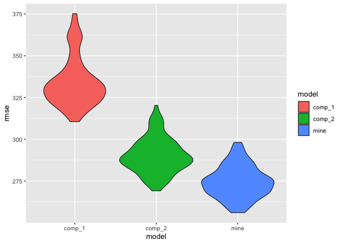

P8105 HW 6
================
Yuki Low (yl5503)
11/27/2023

``` r
library(dplyr)
library(broom)
library(ggplot2)
library(modelr)
library(tidyr)
library(purrr)
library(broom)
```

Importing the weather dataframe

``` r
weather_df = 
  rnoaa::meteo_pull_monitors(
    c("USW00094728"),
    var = c("PRCP", "TMIN", "TMAX"), 
    date_min = "2022-01-01",
    date_max = "2022-12-31") |>
  mutate(
    name = recode(id, USW00094728 = "CentralPark_NY"),
    tmin = tmin / 10,
    tmax = tmax / 10) |>
  select(name, id, everything())
```

We set the seed to maintain consistency and start bootstrapping 5000
samples. We want the estimate for the intercept and both of our
variables `tmin` and `prcp`. We also want the r-squared value that is
calculated from each model obtained.

``` r
set.seed(123)

bootstrap =
  weather_df %>%
  bootstrap(n = 5000) %>%
  mutate(
    models = map(strap, \(df) lm(tmax ~ tmin + prcp, data = df)),
    results = map(models, tidy),
    rsquared = map(models,glance)) %>%
  select(results, rsquared) %>% unnest(rsquared) %>%
  select(results, r.squared) %>% unnest(results) %>%
  select(term, estimate, r.squared) 
```

Plotting the distribution of $R^2$

``` r
bootstrap %>%
  filter(term == "(Intercept)") %>%
  ggplot(aes(x = r.squared)) +
  geom_density()
```

<!-- -->
From looking at the distribution of R-squared values, it can be seen
that there is a slight left skew.

Calculating the confidence interval for R-squared value.

``` r
r_squared_CI <-
  bootstrap %>%
  filter(term == "(Intercept)") %>%
  select(r.squared) %>%
  summarize(ci_lower = quantile(r.squared, 0.025), 
            ci_upper = quantile(r.squared, 0.975))

r_squared_CI
```

    ## # A tibble: 1 × 2
    ##   ci_lower ci_upper
    ##      <dbl>    <dbl>
    ## 1    0.888    0.940

We are 95% confident that our true r-squared value falls in between the
interval (0.8882079, 0.9402552)

Distribution of $log(\beta_1 * \beta_2)$

``` r
bootstrap %>%
  pivot_wider(names_from = term, values_from = estimate) %>% 
  rename(beta_1 = tmin, 
         beta_2 = prcp) %>% 
  mutate(log_beta1_beta2 = log(beta_1 * beta_2)) %>% 
  ggplot(aes(x = log_beta1_beta2)) + 
  geom_density()
```

<!-- --> The
distribution of our $log(\beta_1 * \beta_2)$ terms is skewed to the
left.

``` r
log_beta1_beta2_CI <- bootstrap %>%
  pivot_wider(names_from = term, values_from = estimate) %>% 
  rename(beta_1 = tmin, 
         beta_2 = prcp) %>% 
  mutate(log_b1_b2 = log(beta_1 * beta_2)) %>%
  summarize(ci_lower = quantile(log_b1_b2, 0.025, na.rm = T), 
            ci_upper = quantile(log_b1_b2, 0.975, na.rm = T), 
            NA_count = sum(is.na(log_b1_b2)))
            
log_beta1_beta2_CI
```

    ## # A tibble: 1 × 3
    ##   ci_lower ci_upper NA_count
    ##      <dbl>    <dbl>    <int>
    ## 1    -9.06    -4.62     3363

We are 95% confident that our true $log(\beta_1 * \beta_2)$ value falls
in between the interval (-9.0632139, -4.6192674)

``` r
library(readr)
library(knitr)
library(MASS)
```

2.  Importing the dataset needed and cleaning the data by changing
    variable types

``` r
birthweight_df = 
  read_csv("./birthweight.csv") %>%
  janitor::clean_names() %>% 
  mutate(
  babysex = factor(babysex), 
  babysex = recode_factor(babysex, "male" = "1", "female" = "2"), 
  frace = factor(frace), 
  frace = recode_factor(frace, "white" = "1", "black" = "2", "asian" = "3", 
                       "puerto rican" = "4", "other" = "8", "unknown" = "9"), 
  malform = factor(malform), 
  mrace = factor(mrace), 
  mrace = recode_factor(frace, "white" = "1", "black" = "2", "asian" = "3", 
                       "puerto rican" = "4", "other" = "8")
)
```

Created 3 different models: 1 was mine and 2 were specified by the
problem set instructions. Then, I plotted the residuals vs fitted values
for each of the models.

``` r
model_mine <- lm(bwt ~ babysex + bhead + blength + delwt + fincome + frace + gaweeks +
               malform + menarche + mheight + momage + mrace + parity +
               pnumlbw + pnumsga + ppbmi + ppwt + smoken + wtgain, data = birthweight_df)
model_mine %>% tidy() %>% kable()
```

| term        |      estimate |   std.error |   statistic |   p.value |
|:------------|--------------:|------------:|------------:|----------:|
| (Intercept) | -6318.3419046 | 660.6469220 |  -9.5638709 | 0.0000000 |
| babysex2    |    28.5989636 |   8.4718088 |   3.3757801 | 0.0007426 |
| bhead       |   130.6845905 |   3.4534065 |  37.8422262 | 0.0000000 |
| blength     |    75.0053681 |   2.0231402 |  37.0737372 | 0.0000000 |
| delwt       |     4.1302479 |   0.3950517 |  10.4549548 | 0.0000000 |
| fincome     |     0.3071178 |   0.1796058 |   1.7099546 | 0.0873460 |
| frace2      |  -133.5826255 |  10.2601109 | -13.0196083 | 0.0000000 |
| frace3      |   -52.6085686 |  41.3134470 |  -1.2734006 | 0.2029444 |
| frace4      |  -100.8185204 |  19.1928425 |  -5.2529228 | 0.0000002 |
| frace8      |   -33.1835720 |  73.2881617 |  -0.4527822 | 0.6507283 |
| gaweeks     |    11.5992086 |   1.4667228 |   7.9082488 | 0.0000000 |
| malform1    |     9.9691194 |  70.6958885 |   0.1410141 | 0.8878653 |
| menarche    |    -3.4617103 |   2.8970774 |  -1.1948974 | 0.2321927 |
| mheight     |    10.4318452 |  10.3157128 |   1.0112578 | 0.3119496 |
| momage      |     0.8248761 |   1.2209232 |   0.6756167 | 0.4993202 |
| mrace2      |            NA |          NA |          NA |        NA |
| mrace3      |            NA |          NA |          NA |        NA |
| mrace4      |            NA |          NA |          NA |        NA |
| mrace8      |            NA |          NA |          NA |        NA |
| parity      |    95.6068694 |  40.5193391 |   2.3595367 | 0.0183420 |
| pnumlbw     |            NA |          NA |          NA |        NA |
| pnumsga     |            NA |          NA |          NA |        NA |
| ppbmi       |     5.1566220 |  14.8998890 |   0.3460846 | 0.7292960 |
| ppwt        |    -3.6017790 |   2.6138583 |  -1.3779550 | 0.1682885 |
| smoken      |    -4.7617763 |   0.5868721 |  -8.1138226 | 0.0000000 |
| wtgain      |            NA |          NA |          NA |        NA |

``` r
birthweight_df %>%  
  add_predictions(model_mine) %>% 
  add_residuals(model_mine) %>% 
  ggplot(aes(x = pred, y = resid)) + 
  geom_point() +
  labs(title = "Residuals vs. Fitted Values for My Model ", 
       x = "Fitted",
       y = "Residuals")
```

<!-- -->

``` r
model_1 <- lm(bwt~ blength + gaweeks, data = birthweight_df) 
model_1 %>% tidy() %>% kable()
```

| term        |    estimate | std.error | statistic | p.value |
|:------------|------------:|----------:|----------:|--------:|
| (Intercept) | -4347.66707 | 97.958360 | -44.38281 |       0 |
| blength     |   128.55569 |  1.989891 |  64.60439 |       0 |
| gaweeks     |    27.04673 |  1.717930 |  15.74379 |       0 |

``` r
birthweight_df %>%  
  add_predictions(model_1) %>% 
  add_residuals(model_1) %>% 
  ggplot(aes(x = pred, y = resid)) + 
  geom_point() +
  labs(title = "Residuals vs. Fitted Values for Model 1 ", 
       x = "Fitted",
       y = "Residuals")
```

<!-- -->

``` r
model_2 <- lm(bwt~ bhead * blength * babysex, data = birthweight_df)
model_2 %>% tidy() %>% kable()
```

| term                   |      estimate |    std.error |  statistic |   p.value |
|:-----------------------|--------------:|-------------:|-----------:|----------:|
| (Intercept)            | -7176.8170221 | 1264.8397394 | -5.6740920 | 0.0000000 |
| bhead                  |   181.7956350 |   38.0542051 |  4.7772811 | 0.0000018 |
| blength                |   102.1269235 |   26.2118095 |  3.8962180 | 0.0000992 |
| babysex2               |  6374.8683508 | 1677.7669213 |  3.7996150 | 0.0001469 |
| bhead:blength          |    -0.5536096 |    0.7802092 | -0.7095656 | 0.4780117 |
| bhead:babysex2         |  -198.3931810 |   51.0916850 | -3.8830816 | 0.0001047 |
| blength:babysex2       |  -123.7728875 |   35.1185360 | -3.5244319 | 0.0004288 |
| bhead:blength:babysex2 |     3.8780531 |    1.0566296 |  3.6702106 | 0.0002453 |

``` r
birthweight_df %>%  
  add_predictions(model_2) %>% 
  add_residuals(model_2) %>% 
  ggplot(aes(x = pred, y = resid)) + 
  geom_point() +
  labs(title = "Residuals vs. Fitted Values for Model 2 ", 
       x = "Fitted",
       y = "Residuals")
```

<!-- -->

I performed cross validation on each of the models.

``` r
cv_df <-
  birthweight_df %>% 
  crossv_mc(n = 100) %>% 
  mutate(
    train = map(train, as_tibble), 
    test = map(test, as_tibble))

cv_comp <-
cv_df %>% 
  mutate(
    model_mine  = map(train, ~lm(bwt ~ babysex + bhead + blength + delwt + fincome + frace + gaweeks +
               malform + menarche + mheight + momage + mrace + parity +
               pnumlbw + pnumsga + ppbmi + ppwt + smoken + wtgain, data = .x)),
    model_1  = map(train, ~lm(bwt ~ gaweeks + blength, data = .x)),
    model_2  = map(train, ~lm(bwt ~ bhead*blength*babysex, data = .x))) %>% 
  mutate(
    rmse_mine = map2_dbl(model_mine, test, ~rmse(model = .x, data = .y)),
    rmse_1  = map2_dbl(model_1, test, ~rmse(model = .x, data = .y)),
    rmse_2 = map2_dbl(model_2, test, ~rmse(model = .x, data = .y))) %>% 
  summarize(
    avg_rmse_model_mine = mean(rmse_mine),
    avg_rmse_model_1 = mean(rmse_1),
    avg_rmse_model_2 = mean(rmse_2))

cv_comp
```

    ## # A tibble: 1 × 3
    ##   avg_rmse_model_mine avg_rmse_model_1 avg_rmse_model_2
    ##                 <dbl>            <dbl>            <dbl>
    ## 1                274.             334.             290.

The average RMSE for my model was 274.4954 compared to the first model
which had an average RMSE of 334.7634 and the second model which had an
average RMSE of 289.9159.

``` r
cv_df %>% 
  mutate(model_mine  = map(train, ~lm(bwt ~ babysex + bhead + blength + delwt + fincome + frace + gaweeks +
               malform + menarche + mheight + momage + mrace + parity +
               pnumlbw + pnumsga + ppbmi + ppwt + smoken + wtgain, data = .x)),
         model_comp_1  = map(train, ~lm(bwt ~ gaweeks + blength, data = .x)),
         model_comp_2  = map(train, ~lm(bwt ~ bhead*blength*babysex, data = .x))) %>% 
  mutate(rmse_mine = map2_dbl(model_mine, test, ~rmse(model = .x, data = .y)),
         rmse_comp_1  = map2_dbl(model_comp_1, test, ~rmse(model = .x, data = .y)),
         rmse_comp_2 = map2_dbl(model_comp_2, test, ~rmse(model = .x, data = .y))) %>%
  dplyr::select(rmse_mine, rmse_comp_1, rmse_comp_2) %>%  
  pivot_longer(everything(),
               names_to = "model", 
               values_to = "rmse",
               names_prefix = "rmse_") %>% 
  ggplot(aes(x = model, y = rmse)) + 
  geom_violin(aes(fill = model))
```

<!-- -->
