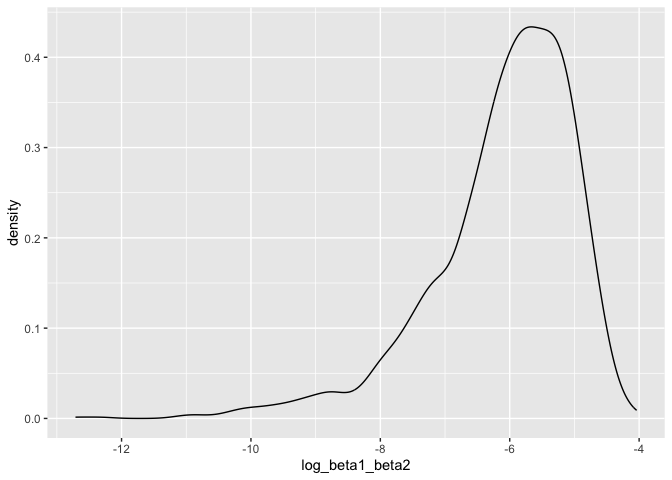

P8105 HW 6
================
Yuki Low (yl5503)
11/27/2023

``` r
library(dplyr)
```

    ## 
    ## Attaching package: 'dplyr'

    ## The following objects are masked from 'package:stats':
    ## 
    ##     filter, lag

    ## The following objects are masked from 'package:base':
    ## 
    ##     intersect, setdiff, setequal, union

``` r
library(broom)
library(ggplot2)
library(modelr)
```

    ## 
    ## Attaching package: 'modelr'

    ## The following object is masked from 'package:broom':
    ## 
    ##     bootstrap

``` r
library(tidyr)
library(purrr)
library(broom)
```

Importing the weather dataframe

``` r
weather_df = 
  rnoaa::meteo_pull_monitors(
    c("USW00094728"),
    var = c("PRCP", "TMIN", "TMAX"), 
    date_min = "2022-01-01",
    date_max = "2022-12-31") |>
  mutate(
    name = recode(id, USW00094728 = "CentralPark_NY"),
    tmin = tmin / 10,
    tmax = tmax / 10) |>
  select(name, id, everything())
```

    ## using cached file: /Users/yukilow/Library/Caches/org.R-project.R/R/rnoaa/noaa_ghcnd/USW00094728.dly

    ## date created (size, mb): 2023-09-28 09:58:44 (8.524)

    ## file min/max dates: 1869-01-01 / 2023-09-30

We set the seed to maintain consistency and start bootstrapping 5000
samples. We want the estimate for the intercept and both of our
variables `tmin` and `prcp`. We also want the r-squared value that is
calculated from each model obtained.

``` r
set.seed(123)

bootstrap =
  weather_df %>%
  bootstrap(n = 5000) %>%
  mutate(
    models = map(strap, \(df) lm(tmax ~ tmin + prcp, data = df)),
    results = map(models, tidy),
    rsquared = map(models,glance)) %>%
  select(results, rsquared) %>% unnest(rsquared) %>%
  select(results, r.squared) %>% unnest(results) %>%
  select(term, estimate, r.squared) 

bootstrap
```

    ## # A tibble: 15,000 × 3
    ##    term        estimate r.squared
    ##    <chr>          <dbl>     <dbl>
    ##  1 (Intercept)  8.07        0.916
    ##  2 tmin         1.02        0.916
    ##  3 prcp        -0.00306     0.916
    ##  4 (Intercept)  8.05        0.914
    ##  5 tmin         1.01        0.914
    ##  6 prcp        -0.00188     0.914
    ##  7 (Intercept)  7.41        0.931
    ##  8 tmin         1.04        0.931
    ##  9 prcp         0.00376     0.931
    ## 10 (Intercept)  8.44        0.905
    ## # ℹ 14,990 more rows

Plotting the distribution of $R^2$

``` r
bootstrap %>%
  filter(term == "(Intercept)") %>%
  ggplot(aes(x = r.squared)) +
  geom_density()
```

<!-- -->
From looking at the distribution of R-squared values, it can be seen
that there is a slight left skew.

Calculating the confidence interval for R-squared value.

``` r
r_squared_CI <-
  bootstrap %>%
  filter(term == "(Intercept)") %>%
  select(r.squared) %>%
  summarize(ci_lower = quantile(r.squared, 0.025), 
            ci_upper = quantile(r.squared, 0.975))

r_squared_CI
```

    ## # A tibble: 1 × 2
    ##   ci_lower ci_upper
    ##      <dbl>    <dbl>
    ## 1    0.888    0.940

We are 95% confident that our true r-squared value falls in between the
interval (0.8882079, 0.9402552)

Distribution of $log(\beta_1 * \beta_2)$

``` r
bootstrap %>%
  pivot_wider(names_from = term, values_from = estimate) %>% 
  rename(beta_1 = tmin, 
         beta_2 = prcp) %>% 
  mutate(log_beta1_beta2 = log(beta_1 * beta_2)) %>% 
  ggplot(aes(x = log_beta1_beta2)) + 
  geom_density()
```

    ## Warning: There was 1 warning in `mutate()`.
    ## ℹ In argument: `log_beta1_beta2 = log(beta_1 * beta_2)`.
    ## Caused by warning in `log()`:
    ## ! NaNs produced

    ## Warning: Removed 3363 rows containing non-finite values (`stat_density()`).

<!-- --> The
distribution of our $log(\beta_1 * \beta_2)$ terms is skewed to the
left.

``` r
log_beta1_beta2_CI <- bootstrap %>%
  pivot_wider(names_from = term, values_from = estimate) %>% 
  rename(beta_1 = tmin, 
         beta_2 = prcp) %>% 
  mutate(log_b1_b2 = log(beta_1 * beta_2)) %>%
  summarize(ci_lower = quantile(log_b1_b2, 0.025, na.rm = T), 
            ci_upper = quantile(log_b1_b2, 0.975, na.rm = T), 
            NA_count = sum(is.na(log_b1_b2)))
```

    ## Warning: There was 1 warning in `mutate()`.
    ## ℹ In argument: `log_b1_b2 = log(beta_1 * beta_2)`.
    ## Caused by warning in `log()`:
    ## ! NaNs produced

``` r
log_beta1_beta2_CI
```

    ## # A tibble: 1 × 3
    ##   ci_lower ci_upper NA_count
    ##      <dbl>    <dbl>    <int>
    ## 1    -9.06    -4.62     3363

We are 95% confident that our true $log(\beta_1 * \beta_2)$ value falls
in between the interval (-9.0632139, -4.6192674)
